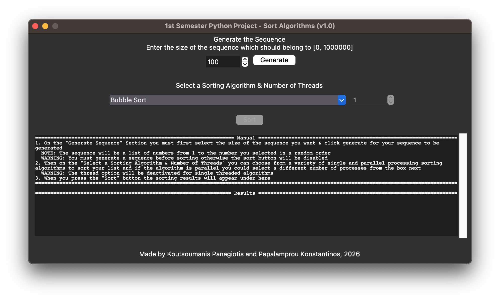

## Implementation of various single and parallel sorting algoritms in Python - 1st semester python project at ECE upatras 

## How to run
Run main code via:
\
`
python3 src/main.py
`

(**NOTE:** Run the bash commands on the project directory)

The application should look like this, follow the on screen menu

## TO DO
1. Sort algoritmhs implementation:
- <s>Bubble sort</s> _@konst3_
- <s>Parallel bubble sort</s> <-- Does not work properly ? _@konst3_
- <s>Odd-Even Transposition Sort</s> <-- Single thread: Do parallel _@konst3_
- <s>Mergesort</s> _@konst3_
- Parallel mergesort _@konst3_
- <s>Quicksort</s> _@devnol_
- Quicksort: Lomuto Partition Scheme
- Quicksort: Hoare Partition Scheme
- Parallel Quicksort                     
- Merging algorithms: Odd-Even Merge
- Merging algorithms: Parallel odd-even merge
- Bitonic mergesort

2. UI implementation (using tkinter):
- <s>Generate a sequence (WARNING: sequence size will be large)</s> _@konst3_
- <s>Choose the algorithm you want to use</s> _@konst3_, _@devnol_
- <s>Show number of processes</s> (would be better if it had core utilization too ?) _@konst3_, _@devnol_
- <s>Show time taken (ms ?)</s> _@devnol_

3. Utils
- <s>UI backend to handle the running of the chosen algorithm</s> _@devnol_

4. Features
- Load a sequence from a file (csv ?)
- Add complexity of an algorithm to UI drop menu

5. Presentation
- Make markdown (update images) _@konst3_
- Make paper
- Make pptx
- Make personal description of contributions to the project 

## Links
https://www.dcc.fc.up.pt/~ricroc/aulas/1516/cp/apontamentos/slides_sorting.pdf

Algorithms\
https://docs.python.org/3/library/multiprocessing.html
https://docs.python.org/2/library/time.html#time.process_time_ns
https://www.geeksforgeeks.org/dsa/odd-even-transposition-sort-brick-sort-using-pthreads/
https://www.geeksforgeeks.org/python/python-program-for-merge-sort/
Γιώργος Μανής - Εισαγωγή στον προγραμματισμό με αρωγό τη γλώσσα python - Kallipos

UI\
ttk.Combobox: https://www.geeksforgeeks.org/python/dropdown-menus-tkinter/\
tk.Spinbox
.bind() --> bind a function on an event of the widget